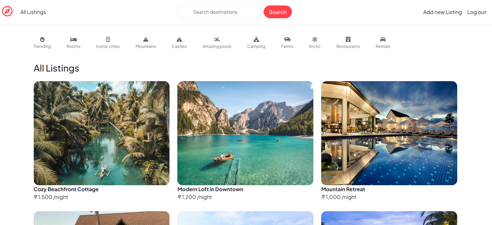
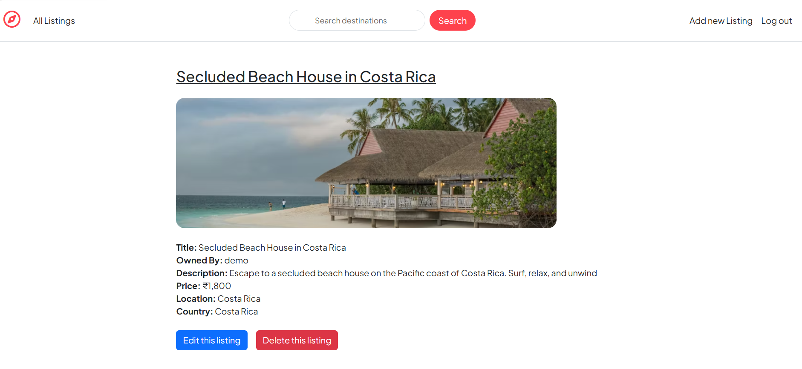
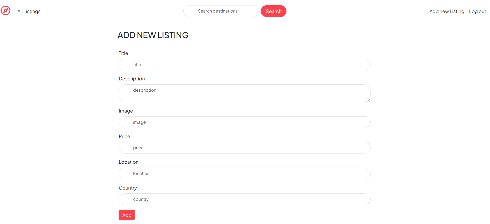
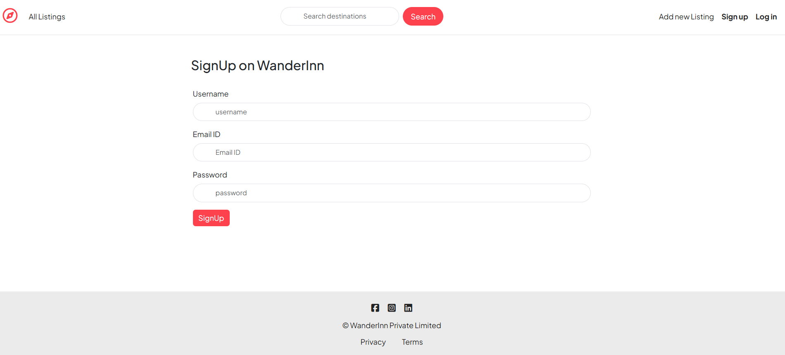

# WanderInn – Full-Stack Travel Listing Platform

A full-stack travel listing web application where users can explore, 
create, manage and review travel stays. Built with MVC architecture 
focusing on secure authentication, robust error handling and clean 
backend design.

🔗 **Live Demo:** https://wanderinn-tu1m.onrender.com/listings

---

## Screenshots





---

## Features

### API & Database:
-	14 RESTful API endpoints across 3 route modules — listings, reviews and users
-	3 Mongoose schemas (User, Listing, Review) with ObjectId references modeling one-to-many relationships
-	Cascade middleware deletes associated reviews when a listing is removed
-	Cloud database hosted on MongoDB Atlas for persistent, production-ready storage

### Authentication & Authorization:
-	Session-based authentication using Passport.js with passport-local strategy
-	express-session configured with httpOnly cookies and 7-day session expiry to prevent XSS and session hijacking
-	6 custom middleware functions with clear separation of concerns — isLoggedIn (authentication), isOwner and isReviewAuthor (authorization), validateListing and validateReview (Joi-based input validation), and saveRedirectUrl (preserving intended destination before login redirect)

### Validation & Error Handling:
-	Joi validation middleware on all listing and review routes rejecting invalid or incomplete inputs server-side
-	Custom ExpressError class with HTTP status codes for structured error responses
-	wrapAsync utility eliminating repetitive try-catch blocks across all async routes
-	Centralized error middleware as single source of truth for all error responses

### Testing & Deployment:
-	10+ automated test cases written using Jest and Supertest covering auth flows, CRUD operations and protected route access
-	Manual testing via Postman and Hoppscotch across all 14 endpoints
-	Deployed on Render with MongoDB Atlas, achieving 1.22s cold load on live environment
-	Environment variables managed via dotenv, keeping credentials out of source code


---

## Tech Stack

| Layer | Technology |
|---|---|
| Backend | Node.js, Express.js |
| Database | MongoDB Atlas, Mongoose |
| Frontend | EJS, Bootstrap |
| Authentication | Passport.js, express-session |
| Validation | Joi |
| Testing | Jest, Supertest |
| Deployment | Render |

---


## Getting Started

### Prerequisites
- Node.js v18+
- MongoDB Atlas account

### Installation

```bash
git clone https://github.com/Arjun-Sreedhar/major-project.git
cd major-project
npm install
```


### Run Locally

```bash
node app.js
```

Visit `http://localhost:8080`

---

## API Overview

| Method | Route | Description | Auth Required |
|---|---|---|---|
| GET | /listings | Get all listings | No |
| POST | /listings | Create new listing | Yes |
| GET | /listings/:id | Get single listing | No |
| PUT | /listings/:id | Update listing | Yes (Owner) |
| DELETE | /listings/:id | Delete listing | Yes (Owner) |
| POST | /listings/:id/reviews | Add review | Yes |
| DELETE | /listings/:id/reviews/:rid | Delete review | Yes (Author) |
| GET | /login | Login page | No |
| POST | /login | Authenticate user | No |
| GET | /signup | Signup page | No |
| POST | /signup | Register user | No |
| GET | /logout | Logout user | Yes |

---

## Key Technical Decisions

- **Passport.js over JWT** — Session-based auth is stateful 
  and better suited for server-rendered EJS applications
- **MongoDB Atlas** — Cloud-hosted database for persistent 
  production storage
- **wrapAsync utility** — Eliminates repetitive try-catch 
  blocks across all async route handlers
- **Joi validation** — Schema-based server-side validation 
  prevents invalid data from reaching the database

---

## Author

**Arjun Sreedhar**  
[GitHub](https://github.com/Arjun-Sreedhar)
